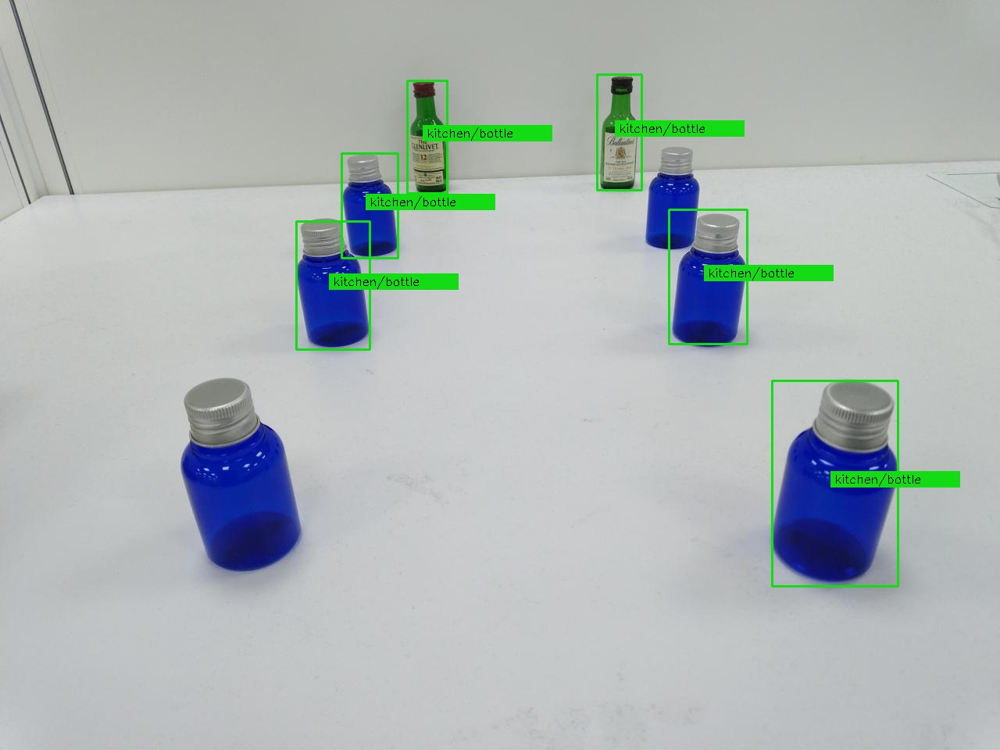

# TI_SK68_am68_auto_drive
Using Ti am68 to implement toy car auto drive.  
Using TI am68 to detect signs for auto driving.  

I don't konw why I can not add toy traffic corn to TI_SK68 by web model composer. (2024/04)  
Work around, short term solution, using small bottle instead of toy traffic corn.  
The native model, ONR-OD-8200-yolox-nano, is good at detecting bottle.  
Thus, my plan,  
(1)The computer runs "wget" to get jpg file from WiFi camera on toy car.   
(2)The computer asks TI_SK68 to detect all bottles X1Y1X2Y2 in the jpg file.  
(3)Then computer controls toy car over bluetooth.  

   

The command to stop Ti_SK68 demo:  
/etc/init.d/edgeai-launcher.sh stop  
 
Ti_SK68/SDK9.1 comes with python demo about interence.  
/opt/edgeai-dl-inferer/tests/test_python/app_dl_inferer_test.py
 
app_dl_inferer_test.py call app_dl_inferer_post_process.py to draw rectangle.
Adding some code in call app_dl_inferer_post_process.py to output rectangle X1Y1X2Y2.
 

# IN PROGRESS ...
