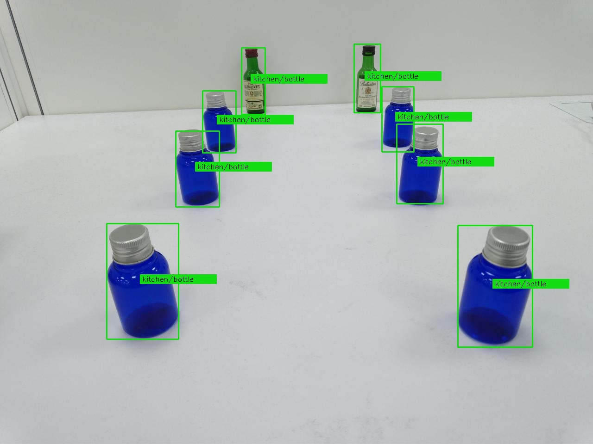

# IN PROGRESS ...
# TI_SK68_am68_auto_drive
Using Ti am68 to implement toy car auto drive.  
Using TI am68 to detect signs for auto driving.  
## Using ONR-OD-8200-yolox-nano and bottle
I don't konw why I CAN NOT add toy traffic corn to TI_SK68 by web model composer. (2024/04)  
I try web model composer and ok in 2024/06.

Work around, short term solution, using small bottle instead of toy traffic corn.  
The native model, ONR-OD-8200-yolox-nano, is good at detecting bottle.  
Thus, my plan,  
(1)The computer runs "wget" to get jpg file from WiFi camera on toy car.   
(2)The computer asks TI_SK68 to detect all bottles X1Y1X2Y2 in the jpg file.  
(3)Then computer controls toy car over bluetooth.  
 
The command to stop Ti_SK68 demo:  
/etc/init.d/edgeai-launcher.sh stop  
 
Ti_SK68/SDK9.1 comes with python demo about inference.  
/opt/edgeai-dl-inferer/tests/test_python/app_dl_inferer_test.py
 
app_dl_inferer_test.py call app_dl_inferer_post_process.py to draw rectangle.  
We can add some code in app_dl_inferer_post_process.py to output rectangle X1Y1X2Y2.  
 
### test
copy pic_test/bottles.jpg to am68 /tmp by scp/ssh.  
run:  
cd /opt/edgeai-dl-inferer/tests/test_python  
python3 app_dl_inferer_test.py -d /opt/model_zoo/ONR-OD-8200-yolox-nano-lite-mmdet-coco-416x416/  -v 0.3 -i /tmp/bottles.jpg  
Then, you get a jpg file of detection_output0_ONR-OD-8200-yolox-nano-lite-mmdet-coco-416x416.jpg at   
/opt/edgeai-dl-inferer/tests/test_python  
 
 

## Using handmade ad25e250 and orange toy traffic cone
Made by model composer.(2024/06)  
### test
Copy ad25e250 to /opt/model_zoo/  
Reboot system  
The [Custom] Model add item of ad25e250. Run it with Camera / USB Camera 0  

# other resource
## disable out-box demo
/etc/init.d/edgeai-launcher.sh stop  
sleep 1  
systemctl stop weston  
sleep 1  
echo 0 > /sys/class/graphics/fbcon/cursor_blink  
dd if=/dev/urandom of=/dev/fb0 bs=7680 count=1080  
 
## get a picture from usb camera
gst-launch-1.0 v4l2src num-buffers=1 device=/dev/video-usb-cam0 \  
! image/jpeg, width=1280, height=720 \  
! jpegdec \  
! jpegenc \  
! filesink location=/home/root/2.jpg  
 
## show jpg file
gst-launch-1.0 filesrc location=/home/root/2.jpg \  
! jpegdec \  
! imagefreeze \  
! waylandsink   fullscreen=true  
